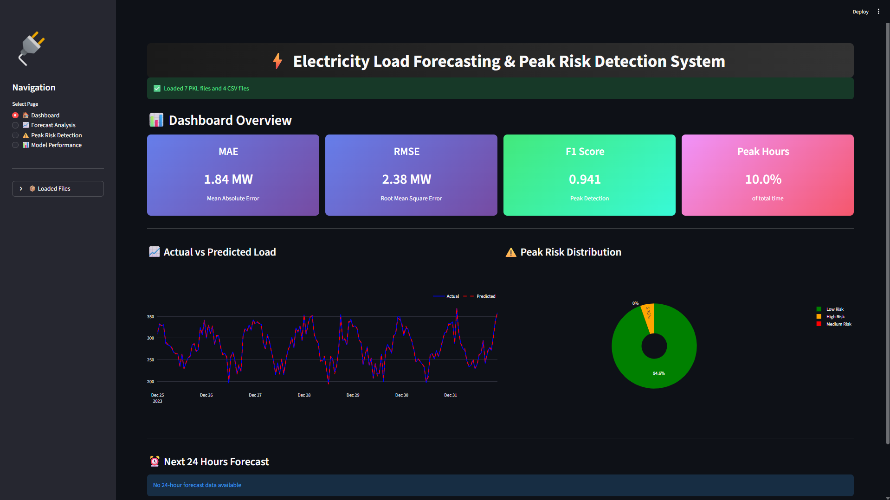
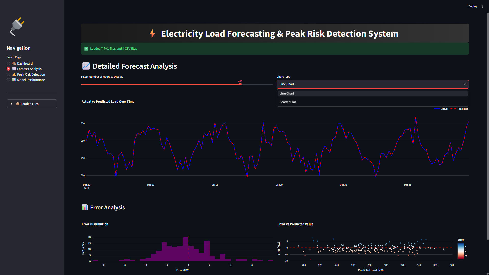
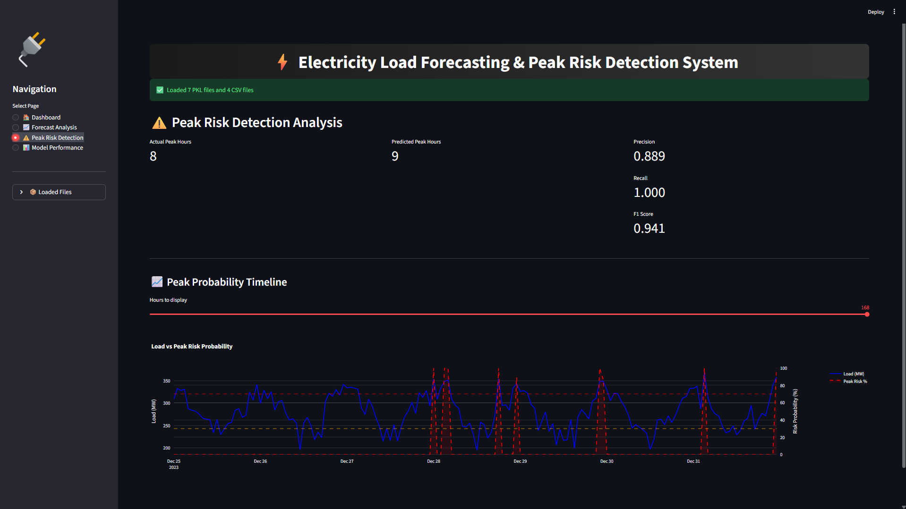

# ⚡ Electricity Demand Forecasting & Peak Risk Detection System

## 📌 Overview
This project builds an end-to-end machine learning system to forecast hourly electricity demand and detect peak-risk periods.

It uses XGBoost models trained on 2 years of hourly data (17,496 records) with engineered features such as time, weather, and lag variables.

The system is deployed using a Streamlit web application for real-time visualization and decision support.

---

## 🚀 Key Features
- 📊 High-accuracy forecasting (R² = 0.9964)
- ⚡ Peak demand detection (Recall = 1.0)
- 📈 24-hour ahead demand prediction
- 🧠 XGBoost-based regression & classification
- 🌐 Interactive Streamlit dashboard
- 📉 Error analysis and visualization

---

## 🛠️ Tech Stack
- Python
- Pandas, NumPy
- XGBoost
- Scikit-learn
- Streamlit
- Plotly

---

## 📊 Model Performance

| Metric | Value |
|------|------|
| MAE | 1.84 MW |
| RMSE | 2.38 MW |
| R² | 0.9964 |
| Precision | 0.889 |
| Recall | 1.000 |
| F1 Score | 0.941 |

---

## 📂 Project Structure

electricity_project/
│── app.py
│── model.ipynb
│── README.md
│── requirements.txt
│── models/
│── data/

---

## ▶️ How to Run

1. Clone the repository

git clone https://github.com/your-username/repo-name.git

2. Install dependencies

pip install -r requirements.txt

3. Run the Streamlit app

streamlit run app.py

---

## 📸 Screenshots

### Dashboard

### Forecast View

### Peak Detection

---

## ⚠️ Limitations
- Trained on only 2 years of data
- No real-time data integration
- Depends on external weather inputs

---

## 🚀 Future Improvements
- Real-time data integration (SCADA)
- LSTM / Transformer models
- Probabilistic forecasting
- Mobile-friendly UI

---

## 👨‍💻 Author
Tushar Kacha  
Isha Kakadiya
MSc Data Science  
